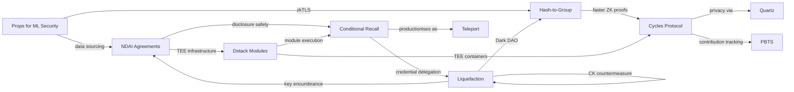

#hackathons

# Shape Rotator — Research Paper Notes

> These notes synthesise the key research papers from the [[Shape Rotator Virtual Hackathon]]. Each paper is summarised for a non-technical audience, with hackathon project ideas and code resources. Papers are cross-linked where concepts overlap.

---

## Table of Contents

1. [[#NDAI Agreements]]
2. [[#Props for ML Security]]
3. [[#Constraint-Friendly Hash-to-Group]]
4. [[#Cycles Protocol]]
5. [[#Liquefaction]]
6. [[#Conditional Recall]]
7. [[#Dstack Semi-Proprietary Modules]]
8. [[#Liquefaction Code (GitHub)]]
9. [[#Quartz (GitHub)]]
10. [[#Persistent BitTorrent Trackers on Dstack (GitHub)]]

---

## NDAI Agreements

> **Paper:** [arxiv.org/pdf/2502.07924](https://arxiv.org/pdf/2502.07924) **Authors:** Matt Stephenson (Pantera), Andrew Miller (Teleport/Flashbots), Xyn Sun (Pantera), Bhargav Annem (Caltech), Rohan Parikh (Nous Research) **Track:** TEE & AI-Enabled Applications **Related papers:** [[#Conditional Recall]], [[#Liquefaction]], [[#Dstack Semi-Proprietary Modules]]

### 1. Summary

This paper formalises how AI agents operating inside Trusted Execution Environments (TEEs) can act as a perfect "ironclad NDA." The core problem — called the disclosure-expropriation paradox — is that an inventor must reveal their idea to get paid for it, but once they reveal it the buyer can just steal it. The paper proves that by placing both buyer's and seller's AI agents inside a secure hardware "black box," full disclosure becomes safe because the TEE guarantees that if no deal is reached, the secret is provably deleted and never leaves the box. They also show this mechanism is surprisingly robust even when the AI agents make mistakes.

### 2. Layman Explanation

Imagine you've invented a secret recipe worth millions. You need to show it to a restaurant chain so they'll buy it — but the moment you show them, what stops them from just copying it and walking away? Historically, nothing reliable.

This paper proposes a solution: put both sides' representatives (AI bots) inside a tamper-proof safe (a TEE). Your bot shows the recipe to their bot inside the safe. Their bot evaluates it. If they agree on a price, the recipe and money swap automatically. If they don't agree, the recipe gets shredded inside the safe — no one outside ever saw it. It's like a perfect NDA enforced by hardware, not lawyers.

Even if the AI bots aren't perfect and sometimes offer the wrong price, the system still works because it has built-in guardrails: a spending cap (so the buyer can't overpay by too much) and a minimum price floor (so the seller can reject lowball offers).

### 3. Key Findings

- Full disclosure becomes rational when expropriation is impossible inside the TEE — this resolves a 60-year-old economics problem (Arrow's paradox) [^1]
- A threshold encryption scheme across multiple TEE providers can secure secrets worth up to ~$1 billion under plausible assumptions
- Budget caps and acceptance thresholds make the mechanism robust even when AI agents have substantial error rates (up to ~55% of the surplus)
- The TEE approach is superior to zero-knowledge proofs or fully homomorphic encryption for this use case because those alternatives leak partial information or create adversarial selection problems

### 4. Hackathon Project Ideas

- **"Shark Tank in a Box"** — A platform where startup founders pitch ideas to investors inside a TEE, with AI agents negotiating terms. Neither side risks IP theft. Think: AngelList meets confidential computing.
- **"Blind Freelancer Marketplace"** — Freelancers demonstrate their proprietary methods/algorithms to clients inside a TEE without revealing source code. Client pays only if the output meets their spec. Solves the "show me your work first" problem in consulting.
- **"Research Bounty Board"** — Academics post encrypted research breakthroughs; corporations bid on them through AI agents in a TEE. If deal is struck, paper and payment swap atomically. If not, the research stays secret. Accelerates tech transfer from universities.

### 5. Application of Code

No dedicated repo yet — builds on **[[#Dstack Semi-Proprietary Modules]]** infrastructure. A hackathon project would involve:

- Deploying AI agents (LLM-based evaluators) inside a dstack TEE container
- Writing a smart contract that governs the payment/disclosure swap
- Using threshold encryption (see [[#Liquefaction]] for key encumbrance patterns) to distribute trust across TEE providers

---

## Props for ML Security

> **Paper:** [arxiv.org/pdf/2410.20522](https://arxiv.org/pdf/2410.20522) **Authors:** Ari Juels (Cornell Tech), Farinaz Koushanfar (UCSD) **Track:** TEE & AI-Enabled Applications **Related papers:** [[#NDAI Agreements]], [[#Conditional Recall]], [[#Liquefaction]]

### 1. Summary

Props ("Protected Pipelines") is a new architecture for securely feeding private data (from behind logins, apps, health portals, etc.) into machine learning systems. Props guarantee two things simultaneously: the data is authentic (it really came from the claimed source, not fabricated) and private (the user controls what gets shared). Props work today using existing blockchain oracle technology (zkTLS and TEEs) without requiring any changes to existing websites.

### 2. Layman Explanation

Think about all the data locked behind your logins — your medical records, bank statements, fitness data, email. This "deep web" is estimated to be 100× larger than the public internet. AI companies desperately need this data to train better models, but there's no safe way to share it today.

Props is like a secure courier service for your private data. You log into your bank through a special app. The app proves to the AI company that your bank statement is real (not faked), but the AI company never gets to see the raw data — they only see what you approve. It's like showing your passport at a border without handing it over; the officer can verify it's real without keeping a copy.

Props can also work in reverse: an AI model runs on your data on your phone, and the result (e.g., "approved for a loan") gets sent to the company with a cryptographic proof that the correct model was used on authentic data — all without revealing your financial details.

### 3. Key Findings

- The deep web (data behind logins) is ~100× larger than the public web — Props unlock this for ML while preserving privacy
- Props provide both integrity (data is authentic) and privacy (data stays under user control) across the entire ML pipeline
- Props can constrain adversarial inputs by authenticating the entire data pipeline from source to model output
- Two practical approaches exist today: TEE-based oracles (like Town Crier) and cryptographic approaches (zkTLS/DECO)
- Props enable new data monetisation models where users get compensated for their private data contributions

### 4. Hackathon Project Ideas

- **"Proof-of-Health"** — Users prove their fitness/health metrics (from Fitbit, Apple Health) to insurance companies or DeFi health pools without revealing raw data. The insurance company gets a verified "this person exercises 5x/week" signal without seeing their entire health record.
- **"LinkedIn but Verified"** — A credential verification layer where professionals prove their employment history (by pulling from actual employer portals via zkTLS) without sharing salaries or private details. Sybil-resistant reputation for DAOs and hackathons.
- **"Private Credit Score for DeFi"** — Users prove their real-world creditworthiness to lending protocols by running a model on their authenticated bank data locally, then submitting only the score with a cryptographic proof. DeFi under-collateralised lending without KYC data exposure.

### 5. Application of Code

Props compose naturally with existing tools:

- **zkTLS / DECO:** Cryptographic data sourcing from any HTTPS website without modifying the server
- **TEE-based oracles** (Town Crier, Chainlink): Hardware-attested data feeds
- **NVIDIA Confidential Computing** for GPU-based model inference inside TEEs
- Combine with **[[#Dstack Semi-Proprietary Modules]]** for TEE container deployment

---

## Constraint-Friendly Hash-to-Group

> **Paper:** [eprint.iacr.org/2025/1503](https://eprint.iacr.org/2025/1503) **Authors:** Jens Groth, Harjasleen Malvai (UIUC), Andrew Miller, Yi-Nuo Zhang **Track:** Cryptographic Primitives & Identity **Related papers:** Underpins ZK proofs used in [[#Cycles Protocol]], [[#Props for ML Security]]

### 1. Summary

This paper proposes a dramatically faster way to perform a fundamental cryptographic operation — mapping messages to points on an elliptic curve — inside zero-knowledge proof systems. Current methods use expensive hash functions that create millions of "constraints" (think: computational steps) the proof system must process. The new approach bypasses the hash function entirely using a mathematical relation that achieves 23× fewer constraints and 50–100× faster proof generation at scale.

### 2. Layman Explanation

Zero-knowledge proofs let you prove something is true without revealing why it's true. For example, proving you know the answer to a puzzle without showing the answer. But generating these proofs is very slow — like writing an exam where every tiny step must be shown.

One of the biggest bottlenecks is a step called "hash-to-group" — converting data into a special mathematical form. The old way of doing this is like translating a book word-by-word through three languages before you can use it. This paper found a shortcut that goes directly from the book to the final language, skipping the intermediate translations. The result: proofs that used to take minutes can now be generated in seconds.

This matters because faster proofs mean cheaper blockchain transactions, faster privacy tools, and more practical zero-knowledge applications in the real world.

### 3. Key Findings

- Achieves **23× fewer constraints** than the best existing hash-to-curve alternatives
- Enables **50–100× faster proving times** at scale
- Works as a drop-in replacement in two major applications: multiset hashing (used in zkVMs for memory checks) and BLS signature verification (used in proof-of-stake blockchains)
- Implemented in Noir/Barretenberg (a popular ZK proving framework)
- Security proven in the generic group model

### 4. Hackathon Project Ideas

- **"Instant Proof-of-Membership"** — A fast ZK system where users prove they belong to a group (e.g., hackathon participants, DAO voters) without revealing their identity. Uses the faster hash-to-group for real-time verification instead of waiting minutes.
- **"ZK-Optimised DAO Voting"** — Plug the faster primitive into an existing ZK voting system to make private ballot casting near-instant. Pairs with [[#Liquefaction]]'s Dark DAO concept but for legitimate privacy-preserving governance.
- **"Light Client Supercharger"** — Speed up BLS signature batch verification for blockchain light clients, allowing mobile wallets to verify proof-of-stake chains much faster. Combine with [[#Cycles Protocol]]'s multi-chain vision.

### 5. Application of Code

- **Implementation available in Noir/Barretenberg** (ZK proving framework)
- Can be integrated into any project using ZK proofs that currently bottleneck on hash-to-curve operations
- Pairs with: zkVM memory consistency checks, BLS signature verification, multiset hashing for state commitments

---

## Cycles Protocol

> **Paper:** [arxiv.org/pdf/2507.22309](https://arxiv.org/pdf/2507.22309) **Authors:** Ethan Buchman (Informal Systems/Cosmos), Paolo Dini, Shoaib Ahmed, Andrew Miller, Tomaž Fleischman **Track:** TEE & AI-Enabled Applications **Related papers:** [[#Liquefaction]], [[#Quartz (GitHub)]] **Code:** [github.com/informalsystems/quartz](https://github.com/informalsystems/quartz)

### 1. Summary

Cycles Protocol is a peer-to-peer clearing system — essentially "Bitcoin for debt." For centuries, banks have formed exclusive clearing clubs to settle massive volumes of debt using very little actual money. Cycles brings this to everyone using blockchain-enabled "atomic multilateral settlement." It finds loops of debt in a network (Alice owes Bob, Bob owes Carol, Carol owes Alice) and cancels them out simultaneously, freeing up liquidity without anyone needing to actually pay cash. Privacy is provided via TEEs (using the Quartz framework), and correctness is verified with zero-knowledge proofs.

### 2. Layman Explanation

Imagine three friends: Alice owes Bob £100, Bob owes Carol £100, and Carol owes Alice £100. Instead of everyone scrambling to find £100 in cash, they simply agree: "let's cancel it all out." Nobody pays anything, and all debts are gone. That's clearing.

Banks have done this for centuries in private clubs. But ordinary people and small businesses — the ones who suffer most from late payments and cash flow problems — are excluded.

Cycles is an app that does this automatically. You upload your invoices and IOUs. The system finds circular chains of debt across all participants and cancels them out in one atomic step (all-or-nothing, so nobody gets cheated). It's like a "debt Tetris" that makes blocks of IOUs disappear when they form a loop.

The privacy layer (powered by Quartz/TEEs) ensures no participant sees anyone else's debts — only the system's secure hardware sees the full picture. Then a ZK proof lets everyone verify the clearing was done correctly without seeing any private data.

### 3. Key Findings

- Clearing can settle more debt with less money — banks save trillions annually this way; Cycles makes it accessible to everyone
- Supports multiple currency types in a single clearing graph (crypto, fiat, mutual credit)
- Four settlement modes: direct payment, bilateral netting, multilateral clearing, and "intent-based" settlement
- Privacy architecture powered by Quartz (TEE framework) with ZK proof verification
- Targets SMEs and individuals who are "systematically excluded" from bank clearing clubs
- Pre-seed funded ($2.3M from CMCC Global, Maven 11, Nascent)

### 4. Hackathon Project Ideas

- **"Hackathon Debt Settler"** — A micro-clearing app for hackathon teams to track who owes what (pizza, cloud credits, design work) and settle it all in one batch. Dogfood the protocol at the hackathon itself. Bonus: use [[#Persistent BitTorrent Trackers on Dstack (GitHub)|PBTS]] to track contribution attribution.
- **"Freelancer Cash Flow Engine"** — A clearing network for freelancers and small agencies where outstanding invoices are matched and netted, reducing the need for cash. Integrates real invoicing data via [[#Props for ML Security|Props]]-style authenticated data sourcing.
- **"DAO Treasury Netting"** — DAOs that transact with each other regularly (grants, services, token swaps) can net their obligations privately using Cycles, reducing gas costs and settlement risk. Links to [[#Liquefaction]]'s private DAO treasury concept.

### 5. Application of Code

- **Quartz:** [github.com/informalsystems/quartz](https://github.com/informalsystems/quartz) — Open-source TEE framework for privacy-preserving apps on Cosmos. Cycles Prime runs on this.
- **Cycles Prime** is the live product (web app + API) for trading firm clearing
- Stack: Cosmos SDK + TEE (dstack) + ZK proofs
- Graph-solving algorithms for finding optimal clearing cycles in debt networks

---

## Liquefaction

> **Paper:** [arxiv.org/pdf/2412.02634](https://arxiv.org/pdf/2412.02634) **Authors:** James Austgen, Andrés Fábrega, Mahimna Kelkar, Dani Vilardell, Sarah Allen, Kushal Babel, Jay Yu, Ari Juels (all Cornell Tech / IC3 / Flashbots) **Track:** TEE & AI-Enabled Applications **Related papers:** [[#NDAI Agreements]], [[#Conditional Recall]], [[#Liquefaction Code (GitHub)]] **Code:** [github.com/key-encumbrance/liquefaction](https://github.com/key-encumbrance/liquefaction)

### 1. Summary

Liquefaction is a wallet platform that demonstrates a fundamental vulnerability in how crypto works: the assumption that private keys are controlled by individual people (called the "SEAO assumption"). Using TEEs, Liquefaction "encumbers" private keys — attaching rich, multi-user access policies to them. This allows assets meant to be non-transferable (locked tokens, soulbound tokens, voting rights, loyalty points) to be secretly rented, shared, or pooled with no on-chain trace. The paper both demonstrates destructive applications (Dark DAOs for vote buying) and constructive ones (privacy-preserving DAOs, dusting attack defence).

### 2. Layman Explanation

In crypto, your private key is like the master key to your house. Everyone assumes only you have it. Many systems depend on this — voting in DAOs, loyalty rewards, "soulbound" identity tokens that are supposed to be permanently yours.

Liquefaction breaks this assumption. It puts your private key inside a secure hardware chip (TEE) and lets you set rules about who can use it, when, and for what. It's like putting your house key in a smart lockbox that lets your friend enter only the living room, only on Tuesdays, only to water the plants.

This has scary implications: someone could secretly rent out their voting rights in a DAO to the highest bidder (a "Dark DAO"). Or sell access to their locked tokens before the lockup expires. All invisibly — nobody on the blockchain can tell.

But it also has positive uses: DAOs could raise money privately (no more losing auctions because your fundraising balance is public), and you could prove you didn't receive tainted funds from a hacker (dusting attack defence).

The paper's key message: this technology is coming whether we like it or not, so blockchain apps need to adopt "Complete Knowledge" (CK) proofs as a countermeasure — proofs that your key is truly yours alone.

### 3. Key Findings

- Implemented and functional on Oasis Sapphire (TEE-based blockchain)
- Breaks the security models of: locked tokens, soulbound tokens, DAO voting, quadratic voting, airdrops, loyalty points, and more
- First complete implementation of a Dark DAO (vote-buying marketplace) as theorised in 2018
- Key encumbrance policies use "asset-time segmentation" — each asset is exclusively controlled by one party at any given time
- Includes a fallback system so keys aren't lost if the TEE blockchain goes offline
- Complete Knowledge (CK) proofs are the recommended countermeasure for applications that need to resist Liquefaction
- Collaborated with Flashbots to demonstrate encumbrance of a real soulbound token

### 4. Hackathon Project Ideas

- **"Proof-of-Sole-Custody"** — Build a CK verification tool that DAOs and airdrops can integrate to prove participants truly own their keys unencumbered. The _defence_ against Liquefaction, not the attack. Critical infrastructure for the ecosystem.
- **"Timeboxed Asset Lending"** — A trustless NFT/token rental marketplace where assets are lent for a fixed period via Liquefaction policies. The borrower gets temporary access; the lender's assets return automatically when time expires. No smart contract transfer needed.
- **"Private DAO Treasury v2"** — Use Liquefaction to create a DAO that raises funds without publicly revealing its balance (solving the ConstitutionDAO problem). Donations stay in donors' encumbered wallets until spent, making the treasury invisible on-chain.

### 5. Application of Code

- **Main repo:** [github.com/key-encumbrance/liquefaction](https://github.com/key-encumbrance/liquefaction)
- Written in **Solidity**, deploys on **Oasis Sapphire** (TEE-based EVM chain)
- Includes implementations of: Dark DAO policy, SBT sharing, dusting attack mitigation
- Architecture: wallet contract + policy contracts (sub-policies form a delegation tree)
- Can serve as a wallet for **any** EVM chain (Ethereum, etc.) while running on Oasis Sapphire

---

## Conditional Recall

> **Paper:** [arxiv.org/abs/2510.21904](https://arxiv.org/abs/2510.21904) **Authors:** Christoph Schlegel, Xinyuan (Xyn) Sun **Track:** TEE & AI-Enabled Applications **Related papers:** [[#NDAI Agreements]], [[#Liquefaction]], [[#Dstack Semi-Proprietary Modules]] **Productionising as:** Teleport

### 1. Summary

This paper explores the game-theoretic power of "credible forgetting" — what happens when an agent can provably commit to erasing information it once knew, conditional on some outcome. TEEs make this possible because code inside a TEE can be proven to delete data. The paper shows that this ability to conditionally forget (and prove it) creates strictly better outcomes in many strategic scenarios: negotiations where NDAs fail, military intelligence sharing, corporate strategy, and credential delegation. The concept is being productionised as Teleport.

### 2. Layman Explanation

Imagine a magic pill that lets you selectively erase specific memories — and prove to others that you've done so. Sounds like science fiction, but TEEs make this real for AI agents.

Why is this useful? Consider hiring a temporary contractor and giving them your Netflix password. Normally, they'd remember it forever. But with "conditional recall," their access is handled by a TEE that provably forgets the password when the contract ends. There's no need to change your password — the system guarantees it was erased.

The paper frames this through a sci-fi story about "Pill X" and then rigorously proves that the ability to credibly forget — something humans can't do but AI agents in TEEs can — resolves several classic game-theory problems where regular commitment devices (like legal contracts) are too expensive or unreliable.

This is already being built as **Teleport** — a product for brokered credential delegation (e.g., sharing your login to a service with a contractor, with the TEE managing access and provably revoking it).

### 3. Key Findings

- Conditional forgetting is a new strategic capability unique to artificial agents in TEEs — it cannot be replicated by humans
- Strictly dominates classical solutions in four categories: hold-up problems, self-enforcing contracts, inefficient equilibria, and Coasian bargaining
- Enables "credential delegation without trust" — share passwords/API keys with the TEE guaranteeing revocation
- Being productionised as Teleport for real-world credential brokering
- Extends the [[#NDAI Agreements]] framework: if NDAI is about disclosing secrets safely, Conditional Recall is about _delegating access_ to secrets safely

### 4. Hackathon Project Ideas

- **"TempKey"** — A credential sharing service where teams can share API keys, cloud logins, and dev credentials during the hackathon, with automatic, provable revocation when the hackathon ends. No more "did you change the AWS key?" Built on Teleport/dstack.
- **"Forget-Me Protocol"** — A data room for M&A or investment due diligence where the buyer's AI agent reviews confidential financials inside a TEE. If the deal falls through, the TEE provably destroys all data. Combines with [[#NDAI Agreements]] for the valuation/payment layer.
- **"Burner Accounts as a Service"** — Temporary, TEE-managed social media or platform accounts that provably self-destruct after a set period. Use case: anonymous whistleblowing, time-limited promotional accounts, disposable developer accounts for testing.

### 5. Application of Code

- **Teleport** is the production implementation (by Flashbots[X])
- Built on **dstack** TEE infrastructure
- GitHub: [github.com/Account-Link/dstack-semiproprietary-modules](https://github.com/Account-Link/dstack-semiproprietary-modules) — related module system for TEE-based credential management
- Key primitives: TEE attestation, key encumbrance (see [[#Liquefaction]]), secure deletion proofs

---

## Dstack Semi-Proprietary Modules

> **Code:** [github.com/Account-Link/dstack-semiproprietary-modules](https://github.com/Account-Link/dstack-semiproprietary-modules) **Track:** TEE & AI-Enabled Applications (infrastructure) **Related papers:** [[#NDAI Agreements]], [[#Conditional Recall]]

### 1. Summary

A practical implementation of encrypted module distribution on dstack (decentralised TEE cloud). Authors encrypt proprietary code modules and publish them to a public bulletin board. TEE enclaves decrypt and execute the modules according to on-chain policy — without the author needing to be online. Includes a self-containment verifier (demonstrated with a Sudoku solver) to prove modules don't cheat by phoning home for answers.

### 2. Layman Explanation

Imagine you've written a brilliant algorithm but don't want anyone to see the source code. You encrypt it and post it publicly. A secure chip (TEE) downloads it, decrypts it internally, runs it, and gives the answer — but nobody, not even the computer's owner, can peek at your code. A smart contract on the blockchain decides who's allowed to run it and under what conditions (e.g., after payment).

The "self-containment check" ensures your encrypted code isn't secretly calling an external server for help — it must work entirely on its own inside the TEE. This is demonstrated with a Sudoku solver: the system verifies the solver actually solves puzzles by itself rather than fetching pre-computed answers.

### 3. Key Findings

- Extends the "contingent payment" ZK proof pattern to executable code modules
- Modules are encrypted with TEE-derived keys; attestation proves enclave integrity
- Smart contract policies enforce payment, time-based access, and authorisation
- Self-containment verification prevents modules from depending on external services
- Uses GitHub Gists as a distributed bulletin board for encrypted module storage

### 4. Hackathon Project Ideas

- **"Algorithm Marketplace"** — A platform where quant researchers sell encrypted trading strategies that run inside TEEs. Buyers pay per-execution but never see the source code. Combines [[#NDAI Agreements]]' disclosure safety with real code execution.
- **"Private AI Model Serving"** — Deploy ML models as encrypted dstack modules. Users pay to run inference but can't extract the model weights. The TEE attests that the correct model ran on the correct input.
- **"Hackathon IP Protection"** — Teams encrypt their hackathon submissions as semi-proprietary modules so judges can evaluate (run) the code without being able to copy it. Perfect for the Bonus Track's "build a tool for your peers" challenge.

### 5. Application of Code

- **Repo:** [github.com/Account-Link/dstack-semiproprietary-modules](https://github.com/Account-Link/dstack-semiproprietary-modules)
- **Stack:** Node.js, Docker, dstack TEE containers
- **Key files:** `enclave/` (TEE code), `private_module/` (author's code), `scripts/` (publishing tools)
- **Quick start:** `npm install` → `node scripts/publish-module.js` → `node enclave/semiprop-service.js`

---

## Liquefaction Code (GitHub)

> **Code:** [github.com/key-encumbrance/liquefaction](https://github.com/key-encumbrance/liquefaction) **Related paper:** [[#Liquefaction]]

### Summary

Open-source Solidity implementation of the Liquefaction wallet on Oasis Sapphire. Includes the core wallet contract, policy contract framework, and implementations of Dark DAO voting policy, SBT sharing, and dusting attack mitigation.

### Key Technical Details

- **Language:** Solidity (EVM-compatible)
- **Deployment target:** Oasis Sapphire (TEE-based EVM chain with private state)
- **Architecture:** Wallet contract + hierarchical sub-policy contracts
- **Transaction types supported:** Ethereum transactions, ERC-191 messages, EIP-712 typed data
- **Accounting:** Sub-balance system for fungible assets across multiple policy holders
- **Fallback:** Liveness fallback system via Ethereum smart contract + backup TEE committee

---

## Quartz (GitHub)

> **Code:** [github.com/informalsystems/quartz](https://github.com/informalsystems/quartz) **Related paper:** [[#Cycles Protocol]]

### Summary

Quartz is Informal Systems' open-source framework for building privacy-preserving applications on Cosmos using TEEs. It powers Cycles Prime's privacy layer, enabling confidential computation on debt graphs while producing ZK proofs of correct clearing. Designed to work with the Cosmos SDK and dstack infrastructure.

### Key Technical Details

- **Stack:** Rust, Cosmos SDK, TEE (dstack)
- **Purpose:** Privacy-preserving smart contract execution on Cosmos chains
- **Use case:** Cycles Protocol uses Quartz for confidential multilateral clearing
- **How it works:** Private computations run inside TEE; ZK proofs generated for on-chain verification

---

## Persistent BitTorrent Trackers on Dstack (GitHub)

> **Code:** [github.com/wichtfx/pbts](https://github.com/wichtfx/pbts) **Author:** François-Xavier Wicht (University of Bern) **Track:** TEE & AI-Enabled Applications **Related papers:** [[#Cycles Protocol]], [[#Dstack Semi-Proprietary Modules]]

### Summary

A BitTorrent tracker that runs inside a TEE on dstack, providing verifiable reputation that persists even if the tracker goes offline. Traditional BitTorrent trackers are centralised and if they die, all reputation data is lost. PBTS stores reputation inside a TEE with attestation proofs, making it portable and tamper-proof.

### Key Technical Details

- **Stack:** Runs on dstack TEE containers
- **Core innovation:** Reputation data is TEE-attested, so it can be migrated to a new tracker without being faked
- **Use case in hackathon:** Contribution tracking for collaborative projects — verifiable record of who shared what datasets, code, or resources

### Hackathon Project Ideas

- **"Proof-of-Contribution Tracker"** — Use PBTS to create a verifiable ledger of who contributed what to a collaborative project (datasets uploaded, code shared, reviews performed). Pairs with [[#Cycles Protocol]] for attribution-based clearing of contributions across teams.
- **"Decentralised Dataset Distribution"** — A system for sharing large ML training datasets via BitTorrent with TEE-verified provenance — you can prove a dataset hasn't been tampered with and track who contributed which portions.

---

## Cross-Reference Map

---

## Key Themes Across Papers

| Theme                                | Papers                                                                                       |
| ------------------------------------ | -------------------------------------------------------------------------------------------- |
| **TEE as trust anchor**              | All papers — TEEs are the shared primitive enabling privacy, confidentiality, and commitment |
| **Disclosure without expropriation** | [[#NDAI Agreements]], [[#Conditional Recall]], [[#Props for ML Security]]                    |
| **Key/credential management**        | [[#Liquefaction]], [[#Conditional Recall]], [[#Dstack Semi-Proprietary Modules]]             |
| **Privacy-preserving computation**   | [[#Cycles Protocol]], [[#Props for ML Security]], [[#Liquefaction]]                          |
| **ZK proof acceleration**            | [[#Constraint-Friendly Hash-to-Group]] — enables faster proofs for all ZK-dependent papers   |
| **Breaking & defending assumptions** | [[#Liquefaction]] (breaks SEAO) vs. Complete Knowledge (defends it)                          |
| **Contribution/reputation tracking** | [[#Persistent BitTorrent Trackers on Dstack (GitHub)]]                                       |

---

#research #IC3 #TEE #cryptography #DeFi #zero-knowledge #hackathon #shape-rotator

[^1]: What is arrow's Paradox